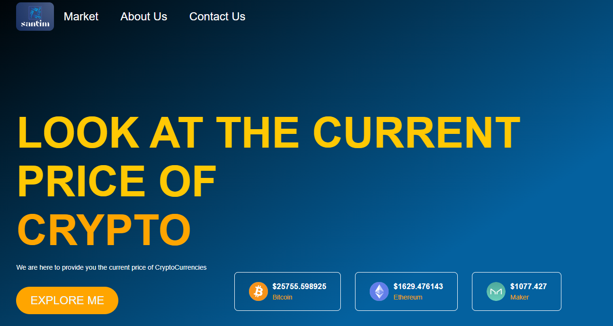

# Crypto Price Tracker Website

This is a simple cryptocurrency price tracker website that allows you to monitor the real-time prices of various cryptocurrencies. It is built using HTML, CSS, Flask, and Python, and it uses a cryptocurrency price API to fetch and display the latest price information.




## Table of Contents

- [Features](#features)
- [Prerequisites](#prerequisites)
- [Installation](#installation)
- [Usage](#usage)
- [API Integration](#api-integration)
- [Contributing](#contributing)
- [License](#license)

## Features

- Real-time cryptocurrency price tracking.
- Support for a wide range of cryptocurrencies.
- Clean and user-friendly interface.
- Easily customizable using CSS.
- Built using Flask, a lightweight Python web framework.

## Prerequisites

Before you can run this cryptocurrency price tracker website, you need to have the following installed on your system:

- Python 3.x: You can download Python from [python.org](https://www.python.org/downloads/).
- Flask: You can install Flask using pip with the command `pip install Flask`.
- An API Key from a cryptocurrency price API provider (e.g., CoinGecko, CoinMarketCap). I used Coinlayer API. You will need to sign up and obtain an API key.

## Installation

1. Clone this repository to your local machine:
  ```
   git clone https://github.com/AbelWondimul/Cryptocurrency.git
  ```
3. Navigate to the project directory:
  ```
   cd crypto-price-tracker
  ```
5. Create a virtual environment (optional but recommended):
  ```
   python -m venv venv
  ```
7. Activate the virtual environment:

- On Windows:

  ```
  venv\Scripts\activate
  ```

- On macOS and Linux:

  ```
  source venv/bin/activate
  ```

5. Install the required dependencies:
  ```
    pip install -r requirements.txt
  ```

## Usage

1. Open the `main.py` file and replace `"YOUR_API_KEY"` with your actual cryptocurrency price API key.

2. Run the Flask application:
  python main.py

3. Open your web browser and navigate to `http://localhost:5000` to access the cryptocurrency price tracker website.

4. You can now search for cryptocurrencies by their symbol (e.g., BTC, ETH) and see their real-time prices displayed on the website.

## API Integration

This project uses a cryptocurrency price API to fetch real-time price data. You can easily switch to a different API provider by updating the API URL in the `main.py` file. Make sure to adapt the API request and response handling code accordingly to match the new API's structure.

## Contributing

Contributions to this project are welcome! If you find any issues or have suggestions for improvements, please open an issue or submit a pull request.


